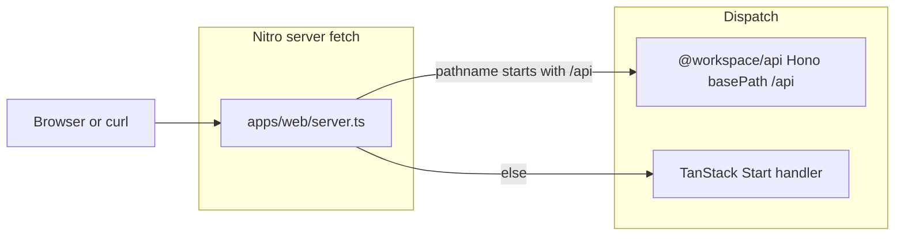

# Add Hono API layer (placeholders)

## Context

- [`apps/web`](apps/web) is TanStack Start on Vite with the [`nitro`](apps/web/vite.config.ts) plugin, but it does **not** yet have an explicit [`server.ts`](https://nitro.build/examples/vite-ssr-tss-react) or `environments.ssr` entry—the official Nitro + TanStack Start flow expects both for a clear `fetch` composition point.
- [ROADMAP.md](ROADMAP.md) already assigns **`packages/api`** as the Hono layer (`web` stays thin). Only [`packages/ui`](packages/ui) exists today, so this work **creates** `packages/api`.

## Architecture

- **Single origin**: same dev server/port as the UI; no CORS needed for same-host fetches.
- **URL convention**: all Hono routes live under **`/api`** (e.g. `/api/health`) so they never collide with app pages. Avoid adding TanStack file routes under [`apps/web/src/routes/api/`](apps/web/src/routes) while this convention holds, or use a different prefix for one of them.

## Implementation steps

### 1. Scaffold `packages/api`

- Add [`packages/api/package.json`](packages/api/package.json): `"name": "@workspace/api"`, `"type": "module"`, `"private": true`, scripts aligned with other packages (`typecheck`, `lint` if you want parity with `ui`), **`hono`** dependency (^4.x).
- Add [`packages/api/tsconfig.json`](packages/api/tsconfig.json): mirror strictness from [`apps/web/tsconfig.json`](apps/web/tsconfig.json) / [`packages/ui/tsconfig.json`](packages/ui/tsconfig.json) (target ES2022, `moduleResolution: "bundler"`, `strict`, `noEmit` for typecheck-only like `ui`).
- Add **`packages/api/src/index.ts`** (or `src/app.ts` + re-export from `index.ts`): export a factory e.g. `createApiApp(): Hono` that builds:
  - `new Hono().basePath("/api")` so route definitions stay short (`/health`, not `/api/health`).
  - **Placeholder routes** (static JSON only, no DB/core):
    - `GET /health` — liveness payload (e.g. `{ "status": "ok", "service": "opsflow-api" }`).
    - `GET /v1/status` — “API not fully mapped” meta (version string, short message).
    - One or two stubs that echo future domains from [PRD.md](PRD.md) (e.g. `GET /v1/placeholder/bookings`, `GET /v1/placeholder/organizations`) returning empty lists or `{ "message": "placeholder" }` so the shape of the API tree exists without business logic.

  Keep handlers trivial; no Zod/`packages/core` until those packages exist (per your “not everything mapped out” constraint).

### 2. Wire Hono into `apps/web` Nitro entry

- Add [`apps/web/server.ts`](apps/web/server.ts) at the **app root** (sibling of `vite.config.ts`), following the Nitro doc pattern:
  - `import handler, { createServerEntry } from "@tanstack/react-start/server-entry"`.
  - `const apiApp = createApiApp()` from `@workspace/api`.
  - `export default createServerEntry({ fetch(request) { ... } })` where `fetch` returns `apiApp.fetch(request)` when `new URL(request.url).pathname.startsWith("/api")`, otherwise `handler.fetch(request)`.

- Update [`apps/web/vite.config.ts`](apps/web/vite.config.ts): add `environments.ssr.build.rollupOptions.input: "./server.ts"` so the SSR/server bundle uses this entry (matches [Nitro’s TanStack Start example](https://nitro.build/examples/vite-ssr-tss-react)).

- Update [`apps/web/package.json`](apps/web/package.json): add workspace dependency `"@workspace/api": "workspace:*"`.

- Update [`apps/web/tsconfig.json`](apps/web/tsconfig.json) `include` if needed so `server.ts` is part of the TS project (array already includes `**/*.ts` at repo-relative paths—confirm it picks up root `server.ts`; adjust include if `tsc` misses it).

### 3. Verify locally (after plan approval)

- `pnpm install` from repo root.
- `pnpm --filter web dev` (or root `pnpm dev`): hit `GET /api/health` and one `/v1/placeholder/...` route; confirm non-API paths still render the React app.

## Notes / future alignment

- When **`packages/core`** and **`packages/types`** land, replace placeholder handlers with Zod-validated inputs and delegation to `core`; optional **Better Auth** session middleware can attach to the same `Hono` instance in `packages/api` without changing the Nitro dispatch shape.
- Optional smoke link on the home page to `/api/health` is not required for the API layer itself; manual `curl` or browser is enough.
